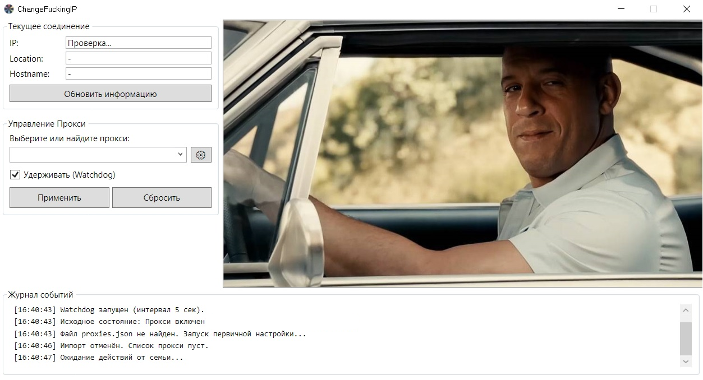

# ChangeFuckingIP 🔄

> **Современная WPF утилита для управления системным прокси в Windows**

Позволяет обходить навязанные групповые политики (Watchdog) и быстро переключать профили прокси. Полная переработка легаси WinForms приложения с современным стеком технологий.

---

## ✨ Основные возможности

### 🛡️ Watchdog Mode
Защита от сброса прокси администраторами или групповыми политиками. Автоматическая проверка и восстановление настроек каждые 5 секунд.

### 🔄 VBS Import
Конвертер старых VBS-скриптов в современный JSON формат. Импортируйте существующие конфигурации одним кликом.

### 🌐 Direct Mode (NAT)
Возможность быстрого переключения на прямое соединение (без прокси) прямо из выпадающего списка. Просто выберите профиль `direct`.

### 🔒 Secure IP Check
Строгая проверка IP без fallback на Direct Connection. Гарантирует отсутствие утечек реального IP при неработающем прокси.

### 🏢 Enterprise Ready
Полная поддержка корпоративных прокси с NTLM/Kerberos аутентификацией через `CredentialCache.DefaultNetworkCredentials`.

### ⚡ Modern WPF UI
- Современный интерфейс с поддержкой системной темы
- Встроенный редактор списка прокси (CRUD)
- Журнал событий с автоскроллом
- Быстрый поиск и фильтрация прокси

---

## 📦 Установка

1. Скачайте последний релиз из раздела [Releases](../../releases)
2. Распакуйте архив в любую папку
3. Запустите `ProxyManager.UI.exe`

### Требования
- **OS**: Windows 10 / 11
- **Runtime**: [.NET 8 Desktop Runtime](https://dotnet.microsoft.com/download/dotnet/8.0)

---

## 🚀 Быстрый старт

1. При первом запуске программа предложит сохранить текущие настройки прокси как "По умолчанию"
2. Выберите прокси из списка или добавьте новый через редактор (⚙️)
3. Нажмите **"Применить"** для активации
4. Включите **"Удерживать (Watchdog)"** для защиты от сброса настроек
5. Для **отключения прокси**: добавьте в список прокси со значением `direct`, выберите его и нажмите "Применить".

---

## 🛠️ Технологии

- **C# 12** / **.NET 8**
- **WPF** (Windows Presentation Foundation)
- **System.Text.Json** для конфигурации
- **Registry API** для управления системным прокси

---

## 📝 Лицензия

MIT License - используйте свободно в личных и коммерческих проектах.

---

## 🤝 Вклад в проект

Pull requests приветствуются! Для крупных изменений сначала откройте issue для обсуждения.

---

**Made with 💪 for bypassing corporate restrictions**
